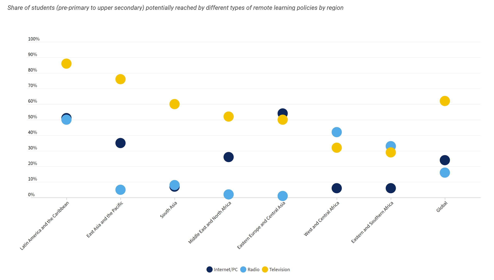

# Lewis-Portfolio
This is my public portfolio for the Telling Stories With Data Class at Carnegie Mellon University (CMU).
# About me
I am Alieyyah J. Lewis (she/her/hers), and I am a second-year graduate student studying Public Policy and Management on the Washington, D.C. track at Carnegie Mellon University. The track is a  highly selective program that integrates graduate coursework in public policy, management, technology, and analytics with a two-semester fellowship based in Washington, D.C., during the second year of study. I am currently serving as a Policy Fellow for DC Appleseed Center for Law and Justice. Upon completing my degree in May 2021, I plan to pursue a career in education policy and advocacy within Federal Education Agencies, State Education Agencies, or Local Education Agencies. 
# What I hope to learn
Due to my previous experiences as an educator and as an alumna of Teach For America (TFA), I have worked with my students, families, administrators, community partners, and TFA to close the achievement gap. I  believe advocacy is the first step to eliminate injustice with the support of data.  I hope and to intertwine both disciplines of public policy and data analysis to ensure all students are receiving an equitable education. Through this course, I am looking forward to developing strong data visualization skills to compliment my ability to analyze data to ensure policymakers and stakeholders understand the compelling stories of educational inequities across the United States.

# Portfolio
<iframe src="https://data.oecd.org/chart/65Jh" width="860" height="645" style="border: 0" mozallowfullscreen="true" webkitallowfullscreen="true" allowfullscreen="true"><a href="https://data.oecd.org/chart/65Jh" target="_blank">OECD Chart: General government debt, Total, % of GDP, Annual, 2019</a></iframe>

# UNICEF Redesign:Can TV solve the remote-learning delimma?
 As a former educator and advocate of equitable education policies, I am concerned about how the COVID-19 pandemic will affect students' ability to learn during the 2020-2021 academic year. UNICEF recently published global analysis of the potential reach of remote learning policies.  With the support of data from UNESCO-UNICEF-World Bank Survey on National Education Responses to COVID-19 School Closures (June-July 2020), household microdata from sources like Multiple Indicator Cluster Surveys (MICS), and  Demographic and Health Surveys (DHS), UNICEF was able to analyze the potential reach of remote learning platforms such as the internet, radio, and television for millions of children who lack access to resources across continents.  Below is UNICEF's visualization output of analysis.

UNICEF's data and visulization objective is to conlcude that TV-based remote learning polices has the poential to reach the greatest proportion of students globally as education stakeholders continue to navigate the pandemic. After extracing the data and conducting a personal analysis, I concur that the data concludes TV-based remote learning policies has the potential to reach the masses as overall analysis, but if one conducts a geogrpahic analysis one may conclude that prefered remote learning policies may differ based upon geogrpahic regions. Thus, it was imperative for my personal analysis to creat sketch redesigns  that told the story of golbal remote learning policies via rating of preferences in clear and concise manner that would still allow for a compartive analysis of the three remote learning platform preferences (internet, radio, and televison). 

# Sketches of UNICEF Redesign & Feedback

I completed teh sketching process in two phases. The first phase was an intial rough draft to allow me to brainstorm how I can enhance the elements of the orignial visulization and create a clear narrative of the sotry. Thus I developed a pie chart. 

My first initial thought was to sketch a pice chart to visualize the remote learning policies as a pie chart. The original data chose to visualize the preference rating for more intent, radio, and television wit percentages. As I began to draw the sketches, I noticed that the ratings were not equal to 100 between the three platforms for remote learning policies. Thus, I knew I must shift my focus and think of a chart that would be a better design for this particular data set. Before I shifted gears, I sought feedback from two colleagues.  Colleagues shared that it was slightly difficult to describe what the visualization conveyed with the pie chart. The potential reach data would not sum up to the whole (100) as they are ratings and not percentage, which can be misleading especially when comparing across multpiple regions. Thus, both colleagues recommend for me to rethink the design and sketch. One colleague provided the specific feedback of trying to redesign the visualization with a bar chart. 

The cluster bar chart allows the visulizations to be more effective.It is more imformative and emotive.  The cluster bar chart allows the viewer to do a comparative analysis, while with ease determine that TV based remote learning policies.

# Final UNICEF Redesign:Can TV solve the remote-learning delimma?

I chose to use Flourish for the final output of the visualization, which would allow for a comparative analysis of rated remote learning police/ platforms across regions. I moved the continents' label on the Y-axis and labeled the X-axis with the potential ratings rather than the percentages. I also added a legend at the top and changed the chart title. With new visualization, you can also filter by virtual learning platform to do an individual analysis. Overall, I still wanted to tell the story that, according to the data, that overall potential reach rating for TV is the greatest. However, possible reach varies across regions, and the data does not explain why. Further analysis would need to be conducted. 

# Proect Proposal

# Project Outline

Project Outline
Summary: Since the establishment of stay at home orders during the COVID-19 pandemic, mental health symptoms have surfaced.
Setup: Stay at home orders, and the COVID-19 pandemic fosters the development of symptoms of anxiety.
Conflict: The story will begin by describing how our "normal" world was turn upside by defining the number of Americans experiencing mental health symptoms such as anxiety at the beginning of the pandemic compared to the number of Americans experiencing symptoms of stress 6 months into the epidemic.
Resolution: Encourage people to develop self-care routines.

# Intital Sketches
![] (draft project sketch.JPG)

# The Data

The data used for this project comes from the National Health Interview Survey (Household Pulse Survey). The Pulse survey is designed to collect data in two phases to understand how the Coronavirus impacts American citizens' lives. The data explores the impact of the virus from 8 sectors: education, employment, food security, health, housing, social security, spending, and transportation.

The Pulse Survey includes a raw data set and cleaned data tables that summarize the Coronavirus's impact across the eight sectors. For this particular project, I will explore Coronavirus's effects on people's health, particularly their mental health. I will use the data tables that analyze the development of anxiety symptoms during the pandemic to conduct comparative from week one of the data collection from Phase 1 and week 13, which is the first week of phase two.

The objective is to explore the impact of the Coronavirus on an individual's development of anxiety symptoms. The goal is to introduce what life was like pre-pandemic and the development of anxiety symptoms and show how anxiety symptoms have increased over the past six months. The data is disaggregated by various socioeconomic statuses, such as age, gender, race, income level, education, and marital status. I think it would be an exciting story to tell how anxiety symptoms have increased over the past six months with data from week 13. I plan to start with data from week 1, then do a mid-pandemic analysis of week 6 o5 7, and then show how anxiety symptoms have increased in week 13.
As a recommendation, I propose that citizens develop a self-care routine and introduce trauma-informed school models for students.

# Presentation Method
Finally, for the presentation method, I will be using Tableau to create data visualizations. I think Tableau will assist with being creative and ensuring the data is depicting the actual story that the information is intended to tell. Also, Tableau will provide more flexibility with manipulating the data the visualization.
In regards to the overall presentation of the data, I am planning to use Esri Story Maps. I have used story maps in the past for previous projects and courses. Esri story maps will allow me to take the audience on a clear and concise journey to understand the development of anxiety symptoms during the pandemic.

https://preview.shorthand.com/wZuLPHeOQmunM8JF

[Final Project Part 1](/final_project_AlieyyahLewis.md)
[Final Project Part 2](/Final_Project_Part2.md)
[Final Project Part 3](/final_project_part3.md)

 
 

